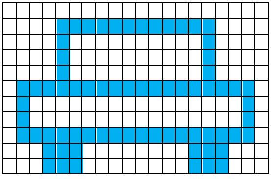

# Exercice 13

L'exercice consiste à
- Écrire du code C de manière à reproduire le motif de l’énoncé de l’exercice
- Répondre à des questions sur la manière avec laquelle vous avez écrit votre code et ce pour vous amener à réfléchir dessus.

Vous veillerez pour cet exercice à
1. **identifier** des patrons ou des motifs similaires dans les grilles à reproduire ;
2. **Déterminer** les opérations permettant de réaliser ces patrons;
3. **Ecrire** une fonction (… paramétrable) par patron ou motif particulier identifié. Cette fonction sera à réutiliser lorsqu’il s’agira de colorier des motifs similaires.

## Réaliser le motif ci-dessous

@[Exercice 13]({"stubs": ["main.c"],"command": "sh /project/target/run.sh", "project" : "exercices"})
