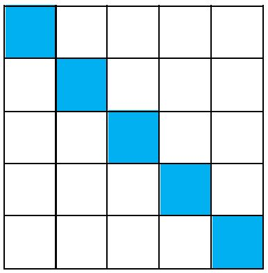

# Exercice 5

## Réaliser le motif ci-dessous

Vous avez pu constater qu'une série de commandes se répétaient systématiquement pour construire le motif de l'exercice 5. Vous venez de découvrir le `repeat`. Essayez de construire le même motif en utilisant le `repeat`.

@[Exercice 5]({"stubs": ["main.c"],"command": "sh /project/target/run.sh", "project" : "exercices"})

### Questions

Répondre aux questions
- Avec le repeat, combien de fois écrivez-vous explicitement « moveDown() » ?
- Si le diagonale à construire ne faisait plus 5 cases mais 50 (dans un paper de 50 x 50). Serait-il simple d'adapter votre solution ? Faites-le ?