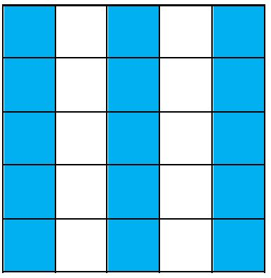

# Exercice 9

## 1. Réaliser le motif ci-dessous
Pour le faire il faut (ATTENTION le paper fait toujours 5 de haut) :
a. Écrire une fonction permettant de colorier une colonne. (Penser que l'on pourrait réutiliser cette fonction à n'importe quelle colonne du paper (curseur toujours en 1ère ligne évidemment)...)
a. Écrire une fonction permettant d'espacer les colonnes.
a. Écrire le programme permettant de dessiner le motif demandé en appelant (éventuellement plusieurs fois, bien entendu) ces 2 fonctions.

## 2. Généraliser le programme à un nombre n variable de colonnes

Pour cette version, on garde nos fonctions telles quelles, mais il faut maintent réécrire le programme qu'il appelle ces fonction n fois, avec n étant une variable contenant le nombre de colonnes à dessiner.

Une variable est une zone de la mémoire qui contient des informations (des données) que l'on peut faire **varier** (d'où le nom de "variable").

Nous aurons besoin de retenir et utiliser uniquement un nombre entier dans notre variable.

Pour cela, nous pourrons déclarer une variable nommée `n` qui contiendra le nombre de colonnes à dessiner (ici, 3) :
```C
int n=3;
```

Cette variable s'écrira au-dessu de :
```C
int main()
{
    //...
}
```

! Il faudra calculer le nombre total de colonnes du Paper en fonction de cette variable `n`, pour cela on peut notamment multiplier avec le signe `*` et soustraire avec le signe `-`.




@[Exercice 9]({"stubs": ["main.c"],"command": "sh /project/target/run.sh", "project" : "exercices"})
